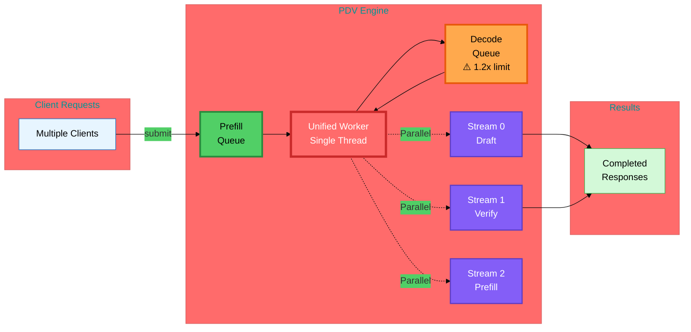
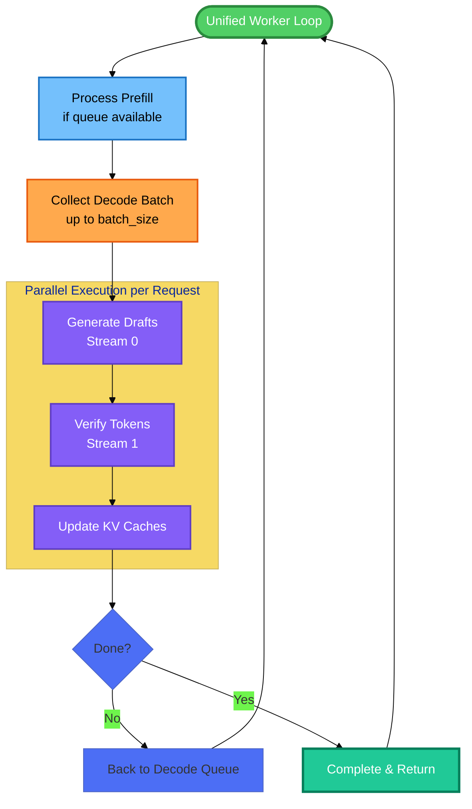
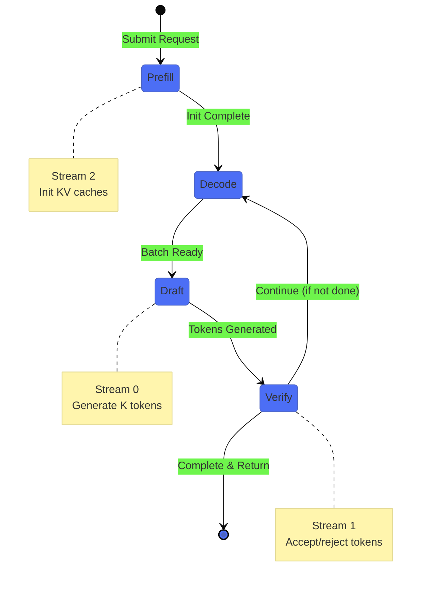
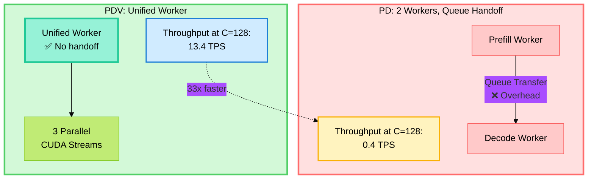

# PDV Architecture - Unified Worker Design

## High-Level Architecture Diagram



### Key Components
- **Prefill Queue**: Incoming requests waiting for initialization
- **Decode Queue**: Active requests with 1.2x batch_size backpressure
- **Unified Worker**: Single thread eliminates handoff overhead
- **3 CUDA Streams**: Parallel execution (Draft, Verify, Prefill)

## Simplified Worker Loop



## How Parallel Streams Work

```mermaid
%%{init: {'theme':'base', 'themeVariables': { 'primaryColor':'#845ef7'}}}%%

gantt
    title PDV Parallel Execution Timeline
    dateFormat X
    axisFormat %L
    
    section Stream 0 (Draft)
    Req 1 Draft    :s0r1, 0, 2
    Req 2 Draft    :s0r2, 2, 4
    Req 3 Draft    :s0r3, 4, 6
    
    section Stream 1 (Verify)
    Req 1 Verify   :s1r1, 2, 5
    Req 2 Verify   :s1r2, 4, 7
    
    section Stream 2 (Prefill)
    New Req Prefill :s2r1, 0, 3
    New Req Prefill :s2r2, 3, 6
```



**Key Insight**: Draft, Verify, and Prefill operations overlap in time, maximizing GPU utilization.

## Request Lifecycle (Simplified)



## PD vs PDV: Side-by-Side Comparison



## Key Architectural Differences

### PD Architecture Issues
1. **Queue Handoff**: Requests must transfer from prefill worker to decode worker
2. **Lock Contention**: Two workers competing for shared resources
3. **Context Switching**: Multiple threads require OS scheduling
4. **Overhead Accumulation**: Each handoff adds latency

### PDV Architecture Advantages
1. **Unified Worker**: Single thread eliminates handoff
2. **Spin-Based Polling**: 0.00001s wait time, no context switching
3. **Adaptive Backpressure**: 1.2x batch_size prevents queue overflow
4. **Stream Parallelization**: Draft, verify, prefill run concurrently
5. **Lock-Optimized**: Minimal critical sections with simple locks

## Performance Summary

### Scaling Behavior at Ultra-High Concurrency

| Concurrency | PD TPS | PDV TPS | Improvement |
|-------------|--------|---------|-------------|
| C = 32 | 10.0 | 13.0 | **+30%** |
| C = 64 | 1.5 | 12.0 | **+700%** |
| C = 96 | 0.5 | 8.0 | **+1500%** |
| C = 128 | 0.4 | 13.4 | **+3250%** |

**Key Insight**: PDV maintains stable throughput while PD degrades at ultra-high concurrency.

**See full performance graphs in `/plots/throughput_comparison.png`**

---

## Technical Implementation Details

### Unified Worker Pseudo-Code

```python
class PDVLiteEngine:
    def _unified_worker_loop(self):
        while self.is_running:
            # Phase 1: Handle prefill (with backpressure)
            if len(prefill_queue) > 0 and len(decode_queue) < 1.2 * batch_size:
                request = prefill_queue.pop()
                prefill(request, stream_id=2)  # Stream 2
                decode_queue.append(request)
            
            # Phase 2: Handle decode batch
            if len(decode_queue) > 0:
                batch = decode_queue.pop_batch(batch_size)
                
                for request in batch:
                    # Parallel execution via CUDA streams
                    draft_tokens = generate_draft(request, stream_id=0)     # Stream 0
                    accepted = verify_tokens(request, draft_tokens, stream_id=1)  # Stream 1
                    
                    update_kv_caches(request, accepted)
                    
                    if request.is_complete():
                        complete_request(request)
                    else:
                        decode_queue.append(request)
            else:
                # Spin-based polling (microsecond-level wait)
                sleep(0.00001)
```

### CUDA Stream Management

```python
# Stream initialization
stream_manager = StreamManager(num_streams=3)
stream_0 = stream_manager.get_stream(0)  # Draft generation
stream_1 = stream_manager.get_stream(1)  # Verification
stream_2 = stream_manager.get_stream(2)  # Prefill

# Parallel execution
with torch.cuda.stream(stream_0):
    draft_output = draft_model(input_ids, past_kv=kv_cache_draft)

with torch.cuda.stream(stream_1):
    verify_output = verify_model(draft_tokens, past_kv=kv_cache_verify)

# Streams execute in parallel, synchronize only when needed
stream_0.synchronize()  # Wait for draft
stream_1.synchronize()  # Wait for verify
```

---

## Design Principles

1. **Simplicity Over Complexity**: Remove coordination overhead by unifying workers
2. **Parallelism Where It Matters**: Use CUDA streams for GPU-level parallelism
3. **Adaptive Control**: Dynamic queue management prevents overflow
4. **Low-Latency Polling**: Spin-based design for minimal context switching
5. **Scalability First**: Architecture designed for ultra-high concurrency (C >= 64)

---

**Last Updated**: December 2024
**Repository**: https://github.com/therealnaveenkamal/pdverify

