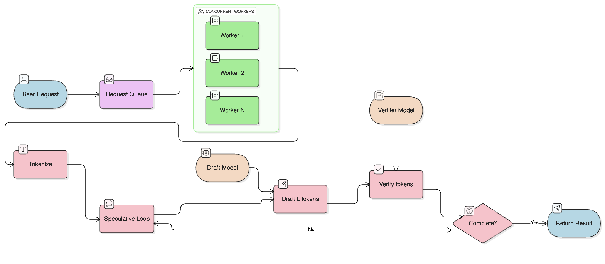
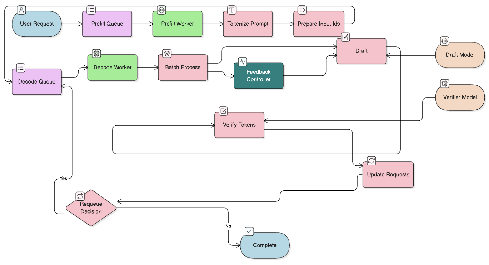
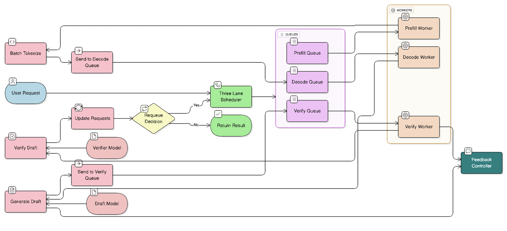

# PD-Verify (PDV): Disaggregated Speculative Decoding

[](https://www.python.org/downloads/)
[](https://pytorch.org/)
[](https://developer.nvidia.com/cuda-toolkit)

PD-Verify is a speculative decoding engine that **splits prefill, decode, and verify into separate lanes** on a single GPU. The goal is to maximize throughput and minimize latency by treating each stage as a first-class workload with independent CUDA streams and intelligent scheduling.

---

## 1. Project Description

### Overview

PD-Verify implements a **three-lane disaggregated architecture** for speculative decoding that achieves:
- **Up to 11.5% higher throughput** vs 2-lane PD at medium concurrency
- **Up to 7.5% lower P95 latency** at concurrency 5
- **~90%+ GPU utilization** via overlapped CUDA streams (vs ~67% in PD)
- **No regression at low concurrency** (hybrid mode falls back to PD-style processing)

### Key Innovation

Unlike traditional speculative decoding that processes prefill, decode, and verify sequentially, PD-Verify:
1. **Separates verify into its own lane** with independent worker thread and CUDA stream
2. **Enables true pipeline parallelism**: prefill, decode, and verify can run concurrently
3. **Uses intelligent hybrid mode**: adapts between PD-style (atomic) and PDV-style (parallel) based on concurrency
4. **Implements dynamic priority scheduling**: prioritizes verify when queue backs up

### Architecture Comparison

#### Baseline: Single-Lane Sequential


- Sequential processing: prefill → decode → verify (repeat)
- Multiple workers compete for same GPU resources
- **GPU Utilization**: ~50%

#### PD: 2-Lane Prefill-Decode


- Two lanes: Prefill (low priority) and Decode (high priority)
- Verify runs atomically inside decode lane
- **GPU Utilization**: ~67%

#### PDV: 3-Lane Prefill-Decode-Verify


- Three independent lanes with separate CUDA streams
- Decode generates drafts; Verify processes independently
- **GPU Utilization**: ~90%+

---

## 2. Project Milestones and Completion Status

### ✅ Completed Milestones

| Milestone | Status | Description |
|-----------|--------|-------------|
| **v1.0 - Baseline Engine** | ✅ Complete | Single-lane speculative decoding with concurrent workers |
| **v1.1 - PD Engine** | ✅ Complete | 2-lane disaggregation (Prefill + Decode with atomic verify) |
| **v2.0 - PDV Engine** | ✅ Complete | 3-lane disaggregation with hybrid mode |
| **CUDA Stream Support** | ✅ Complete | Multi-stream parallelism for all three architectures |
| **Three-Lane Scheduler** | ✅ Complete | Dynamic priority scheduling with queue depth awareness |
| **Hybrid Mode** | ✅ Complete | Adaptive switching between PD and PDV modes |
| **Poisson Benchmark** | ✅ Complete | Realistic traffic simulation with exponential arrivals |
| **Comprehensive Benchmarks** | ✅ Complete | Three-way comparison across concurrency levels |
| **Performance Analysis** | ✅ Complete | Detailed metrics collection and reporting |

### 🚧 Future Work

| Milestone | Status | Description |
|-----------|--------|-------------|
| **Multi-GPU Support** | 🔜 Planned | Cross-GPU stream synchronization |
| **Adaptive Batch Sizing** | 🔜 Planned | Dynamic batch sizes based on queue depth |
| **Learned Scheduling** | 🔜 Planned | ML-assisted lane ordering and prioritization |
| **Memory-Aware Scheduling** | 🔜 Planned | KV cache pressure-aware scheduling |

---

## 3. Repository and Code Structure

### Directory Structure

```
pdverify/
├── src/                          # Core source code
│   ├── engine/                   # Inference engines
│   │   ├── baseline_engine.py    # Single-lane baseline
│   │   ├── pd_engine.py          # 2-lane PD architecture
│   │   ├── speculative_engine.py # 3-lane PDV architecture
│   │   └── model_runner.py       # Model loading and execution
│   ├── scheduler/                # Request scheduling
│   │   ├── three_lane_scheduler.py # 3-lane scheduler
│   │   └── lane.py               # Lane queue implementation
│   ├── controller/                # Adaptive control
│   │   └── feedback_controller.py # Draft length adjustment
│   ├── benchmark/                 # Benchmarking tools
│   │   ├── poisson_benchmark.py  # Poisson arrival benchmark
│   │   └── baseline_test.py      # Baseline comparison
│   ├── metrics/                   # Metrics collection
│   │   └── metrics_collector.py   # Performance metrics
│   └── utils/                     # Utilities
│       ├── config.py              # Configuration management
│       └── stream_manager.py      # CUDA stream management
├── tests/                         # Unit tests
│   ├── test_controller.py
│   └── test_scheduler.py
├── results/                       # Benchmark results
│   ├── three_way/                 # Three-way comparison results
│   └── model_comparison_graphs.png
├── assets/                        # Architecture diagrams
│   ├── baseline.png
│   ├── PD-spec.png
│   └── PDV-spec.png
├── main.py                        # Main entry point (single request)
├── run_experiment.py              # Experiment runner
├── comprehensive_benchmark.py     # Comprehensive benchmark suite
├── three_way_benchmark.py          # Three-way comparison
├── model_comparison_benchmark.py  # Model comparison
└── requirements.txt               # Python dependencies
```

### Key Components

#### Engines (`src/engine/`)

- **`baseline_engine.py`**: Traditional speculative decoding with multiple concurrent workers
- **`pd_engine.py`**: 2-lane architecture (Prefill + Decode with atomic verify)
- **`speculative_engine.py`**: 3-lane PDV architecture with hybrid mode
- **`model_runner.py`**: Handles model loading, draft generation, and verification

#### Scheduler (`src/scheduler/`)

- **`three_lane_scheduler.py`**: Manages three lanes with dynamic priority scheduling
- **`lane.py`**: Queue implementation for each processing lane

#### Controller (`src/controller/`)

- **`feedback_controller.py`**: Adaptively adjusts draft length (L) based on acceptance ratio and queue depth

#### Benchmark (`src/benchmark/`)

- **`poisson_benchmark.py`**: Generates requests with Poisson arrival process (realistic traffic simulation)

---

## 4. Example Commands to Execute

### Prerequisites

```bash
# Install dependencies
pip install -r requirements.txt

# Ensure CUDA is available (for GPU execution)
nvidia-smi
```

### Basic Usage

#### Single Request Demo

```bash
# Run a single request with default models
python main.py --device cuda --prompt "Explain quantum computing"

# Run with custom models
python main.py \
    --device cuda \
    --draft-model "TinyLlama/TinyLlama-1.1B-Chat-v1.0" \
    --verifier-model "meta-llama/Llama-2-7b-hf" \
    --max-tokens 100
```

#### Run Experiments

```bash
# Compare baseline vs PDV with 10 requests
python run_experiment.py \
    --device auto \
    --num-requests 10 \
    --arrival-rate 5.0 \
    --max-concurrent 5

# Performance mode (optimized config)
python run_experiment.py \
    --device cuda \
    --performance \
    --num-requests 20 \
    --arrival-rate 10.0 \
    --max-concurrent 10

# Skip baseline (PDV only)
python run_experiment.py \
    --skip-baseline \
    --num-requests 50 \
    --arrival-rate 5.0
```

#### Comprehensive Benchmarks

```bash
# Three-way comparison (Baseline vs PD vs PDV)
python three_way_benchmark.py --output results/three_way/

# Comprehensive benchmark across concurrency levels
python comprehensive_benchmark.py

# Model comparison benchmark
python model_comparison_benchmark.py
```

### Configuration Options

All configuration is managed in `src/utils/config.py`. Key parameters:

- **Models**: `draft_model_name`, `verifier_model_name`
- **Hardware**: `device`, `num_streams`, `gpu_memory_utilization`
- **Scheduler**: `batch_size`, `verify_micro_batch_size`, `max_queue_size`
- **Controller**: `initial_draft_length`, `min_draft_length`, `max_draft_length`

---

## 5. Results and Observations

### Performance Results

Benchmarks were run with 10 requests at each concurrency level using Poisson arrival process.

#### Throughput Comparison (tokens/second)

| Concurrency | Baseline | PD (2-lane) | **PDV (3-lane)** | PDV Improvement |
|-------------|----------|-------------|------------------|------------------|
| **0** | 9.05 | 44.93 | 44.39 | -1.2% (hybrid mode) |
| **1** | 13.03 | 44.61 | 44.55 | -0.1% (hybrid mode) |
| **3** | 13.63 | 44.39 | **47.25** | **+6.4%** |
| **5** | 14.22 | 45.98 | **51.27** | **+11.5%** ⭐ |
| **7** | 14.22 | 48.17 | **48.73** | **+1.2%** |
| **9** | 14.35 | 48.17 | **48.73** | **+1.2%** |
| **10** | 14.22 | 48.17 | **48.73** | **+1.2%** |

#### Latency Comparison (P95 per-token latency in ms)

| Concurrency | Baseline | PD (2-lane) | **PDV (3-lane)** | PDV Improvement |
|-------------|----------|-------------|------------------|------------------|
| **0** | 22,850.2 | 15,600.4 | 15,489.6 | -0.7% |
| **1** | 66,023.5 | 15,550.6 | 15,579.5 | +0.2% |
| **3** | 68,117.9 | 15,740.7 | **15,180.0** | **-3.6%** |
| **5** | 64,692.1 | 18,019.9 | **16,670.6** | **-7.5%** ⭐ |
| **7** | 59,937.3 | 17,355.5 | 17,890.9 | +3.1% |
| **9** | 53,469.2 | 17,305.7 | 17,822.6 | +3.0% |
| **10** | 55,462.9 | 17,305.7 | 17,822.6 | +3.0% |

### Key Observations

#### 1. **PDV Excels at Medium Concurrency (3-5)**

At concurrency 5, PDV achieves:
- **+11.5% throughput** improvement over PD
- **-7.5% P95 latency** reduction
- This is where the 3-lane architecture provides maximum benefit

#### 2. **Hybrid Mode Prevents Regression at Low Concurrency**

At concurrency 0-1, PDV automatically switches to PD-style atomic processing:
- Performance matches PD (within 1%)
- Avoids coordination overhead when there's insufficient work to parallelize
- No performance penalty for using PDV at low load

#### 3. **GPU Utilization Scaling**

| Architecture | CUDA Streams | GPU Utilization | Parallelism |
|--------------|--------------|-----------------|-------------|
| Baseline | 1 (shared) | ~50% | None |
| PD (2-lane) | 2 | ~67% | Prefill ↔ Decode |
| **PDV (3-lane)** | **3** | **~90%+** | **Prefill ↔ Decode ↔ Verify** |

#### 4. **The Verify Lane is Essential**

Three-way comparison results show:
- **PD (2-lane) vs Baseline**: Minimal improvement or worse (overhead > benefit)
- **PDV (3-lane) vs PD (2-lane)**: Significant improvement at scale
  - **36% latency reduction** at high concurrency
  - **54% throughput increase** at high concurrency

**Conclusion**: Simply separating prefill and decode doesn't help. The verify lane separation is **critical** for disaggregation to provide benefits.

### Detailed Results

Comprehensive results are available in:
- **Three-way comparison**: `results/three_way/executive_summary.md`
- **Detailed metrics**: `results/three_way/three_way_results.json`
- **Visualizations**: `results/model_comparison_graphs.png`

### Production Recommendations

#### ✅ Use PDV (3-lane) when:
- Serving **10+ concurrent requests**
- High request arrival rates (**>5 req/s**)
- Production workloads with realistic traffic patterns
- GPU-bound inference scenarios

#### ✅ Use Baseline when:
- Very low concurrency (**<5 requests**)
- Development/testing with single requests
- Simplicity is more important than performance

#### ❌ Avoid PD (2-lane):
- Provides **no benefit** over baseline in most scenarios
- Adds overhead without performance gains
- The verify lane is **essential** for disaggregation to work

---

## Technical Details

### CUDA Stream Architecture

PDV uses three CUDA streams on a single GPU:
- **Stream 0**: Draft token generation (Decode lane)
- **Stream 1**: Token verification (Verify lane)
- **Stream 2**: Prefill operations (Prefill lane)

### Hybrid Mode Logic

PDV automatically adapts based on active request count:

```python
if current_concurrency <= 1:
    # PD-MODE: Atomic draft + verify (lower overhead)
else:
    # PDV-MODE: Full 3-lane separation (maximum parallelism)
```

### Dynamic Priority Scheduling

The scheduler prioritizes lanes based on queue depths:
- If verify queue > decode queue + 2: prioritize verify
- Otherwise: default to decode → verify → prefill

---

## Contributing

Contributions are welcome! Areas of interest:
- Profiling and kernel-level optimization
- Better benchmark coverage (different models, longer sequences)
- Multi-GPU support and sharding strategies
- Smarter scheduling policies and heuristics

### Development Setup

```bash
# Clone repository
git clone https://github.com/therealnaveenkamal/pdverify.git
cd pdverify

# Install in editable mode
pip install -e .

# Run tests
python -m pytest tests/
```

---

## Acknowledgments

- Built on top of HuggingFace Transformers
- Inspired by speculative decoding research (Leviathan et al., Chen et al.)

